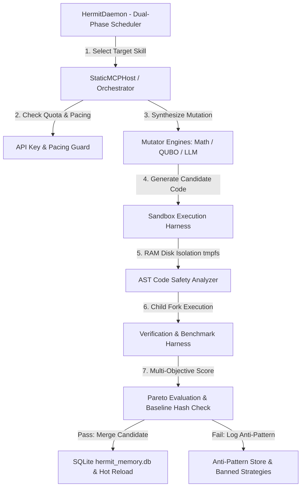

# Project Hermit - Autonomous Self-Evolving Multi-Agent System & Dynamic MCP Tool Host

[](file:///root/home/projects/project-hermit-git/v0.1.9)
[](https://www.python.org/)
[](LICENSE)
[](file:///root/home/projects/project-hermit-git/v0.1.9/test_hermit.py)

**Project Hermit** is a Mobile-native, closed-loop autonomous self-optimization engine and dynamic Model Context Protocol (MCP) tool host. Operating as a background daemon (`hermit_daemon.py`), Hermit continuously discovers, profiles, refactors, and tests Python payload routines inside isolated RAM-disk sandbox environments (`sandbox.py`) using LLM-driven code synthesis combined with deterministic mathematical and AST mutators (`math_mutator.py`, `qubo_mutator.py`).

---

## Technical Overview

Project Hermit resolves five critical operational failures common to long-horizon autonomous AI systems:

1. **Queue Starvation (Phase 1 vs. Phase 2 Dual-Phase Scheduling)**: Prevents high-latency functions from monopolizing mutation cycles by alternating between exploration of zero-merge functions sorted by optimization headroom ($H = \text{latency} \times \text{complexity}$) and exploitation of bottleneck functions with concurrency caps (`MAX_CONSECUTIVE = 3`).
2. **Strategy Oscillation (6-Merge Sequence Pattern Banning)**: Replaces simplistic count-based strategy banning with sequence pattern detection (`A-B-A-B` or `A-B-C-A-B-C` over a 6-merge window), eliminating false-positive bans on newly merged successful code.
3. **RAM Measurement Distortion (Fork-Based Grandchild Isolation)**: Captures exact, non-cumulative peak RSS per candidate run, eliminating historical `RUSAGE_CHILDREN` cumulative noise.
4. **Thermal & Quota Resilience**: Predictively throttles execution based on CPU temperature trend slopes (`/sys/class/thermal/`) and enforces pacing delay guards between outbound LLM API requests.
5. **Host Protection & Introspection Rollback (`IMMUTABLE_FUNCTIONS`)**: Protects core host looper functions (`get_next_target`, `sandbox_run`, `detect_oscillation`) from self-mutation and automatically rolls back failed introspection patches via versioned database snapshots (`.hermit_backup_v*`).

---

## Human-AI Engineering & Development Environment

Project Hermit was engineered through **Human-AI Collaboration** between the developer and the **Google Antigravity CLI**:

* **Development Environment & Host Hardware**: Built and benchmarked entirely on a **Samsung Galaxy A36** running **Termux** inside a **PRoot** virtualized Linux environment.
* **Human-AI Collaboration Model**:
  * **Developer**: Directed project goals, identified mobile hardware constraints (thermal throttling on ARM/mobile devices, queue starvation, memory reporting issues), defined system requirements, and guided architectural iterations.
  * **Google Antigravity CLI**: Served as the AI pair programmer in Termux/PRoot to implement AST mutator engines, write verification test suites, refactor core engines, and generate full repository documentation artifacts.

---

## Architecture Diagram



---

## Repository Structure & Document Sitemap

All detailed documentation, architectural specs, threat models, and research ledgers generated under the *Repository Reconstruction Roadmap (v1.0)* standard are located in the [docs](docs/README.md) directory.

### Quick Links to Reconstructed Documentation Artifacts:

| Document | Description |
| :--- | :--- |
| **[PROJECT_OVERVIEW.md](docs/PROJECT_OVERVIEW.md)** | Core purpose, problem statement, engineering goals, target users, and non-goals. |
| **[ARCHITECTURE.md](docs/ARCHITECTURE.md)** | Module responsibilities, Mermaid execution flows, dynamic MCP server payload decoupling, and APIs. |
| **[HISTORY.md](docs/HISTORY.md)** | Chronological history across 19 release directories (`v0.0.1` to `v0.1.9`) and architectural pivots. |
| **[DESIGN_DECISIONS.md](docs/DESIGN_DECISIONS.md)** | Engineering trade-offs, rejected alternatives, sandbox security choices, and optimization rationale. |
| **[FEATURES.md](docs/FEATURES.md)** | Detailed inventory of host engines, specialized AST mutators (Math & QUBO), and active payload tables. |
| **[INSTALL.md](docs/INSTALL.md)** | Prerequisites, virtual environment setup, API key environment configuration, and test commands. |
| **[USAGE.md](docs/USAGE.md)** | Quick start steps, background daemon controls, monitoring operations, and interactive CLI usage. |
| **[API.md](docs/API.md)** | Complete Python API reference for `Orchestrator`, `HermitDaemon`, `sandbox.py`, and AST safety analyzers. |
| **[CONFIGURATION.md](docs/CONFIGURATION.md)** | Environment variables, runtime parameters, default settings, and database table schemas. |
| **[SECURITY.md](docs/SECURITY.md)** | Threat model, AST static safety filtering (`analyze_code_safety`), and RAM disk isolation. |
| **[PERFORMANCE.md](docs/PERFORMANCE.md)** | Empirical latency gains, AST/QUBO math mutator efficiency, memory footprint, and thermal scaling. |
| **[TESTING.md](docs/TESTING.md)** | Multi-layered test hierarchy, frozen baseline harness hash verification, and downstream regression tests. |
| **[RESEARCH.md](docs/RESEARCH.md)** | Researcher agent architecture (`researcher.py`), experimental hypotheses, notes storage, and conclusions. |
| **[LIMITATIONS.md](docs/LIMITATIONS.md)** | Technical debt, token cost escalation on complex functions, Linux kernel bounds, and unsupported features. |
| **[PROJECT_STATUS.md](docs/PROJECT_STATUS.md)** | Living project status, recent `v0.1.9` hardening achievements, and current development priorities. |
| **[NEXT_STEPS.md](docs/NEXT_STEPS.md)** | Future roadmap (Docker sandboxing, AST mutator expansion, remote MCP transport, dynamic RL scheduling). |
| **[PROJECT_EVIDENCE.md](docs/PROJECT_EVIDENCE.md)** | Raw Pass A evidence extraction log containing un-summarized facts from 1,157 files. |
| **[PROJECT_MANIFEST.md](docs/PROJECT_MANIFEST.md)** | Phase 0 project inventory manifest detailing directory file counts and schema tables. |
| **[READINESS_SCORE.md](docs/READINESS_SCORE.md)** | Final Repository Evaluation Report assigning Project Hermit a score of **96/100 (A+)**. |

---

## Quick Start Guide

### 1. Set Up Environment & API Key
```bash
cd project-hermit-git/v0.1.9
python3 -m venv venv
source venv/bin/activate
pip install google-genai psutil

# Export your Gemini API key
export GEMINI_API_KEY="your-actual-api-key"
```

### 2. Verify System & Run Unit Tests
```bash
# Run structural host verification test
python3 orchestrator.py --mode shadow_test

# Run main integration test suite (17/17 passing)
python3 test_hermit.py
```

### 3. Launch Autonomous Background Optimization Daemon
```bash
python3 hermit_daemon.py
```

### 4. Monitor Real-Time System Metrics
```bash
python3 monitor_evolution.py
```

---

## License

This project is licensed under the Apache License 2.0 - see the [LICENSE](LICENSE) file for details.
