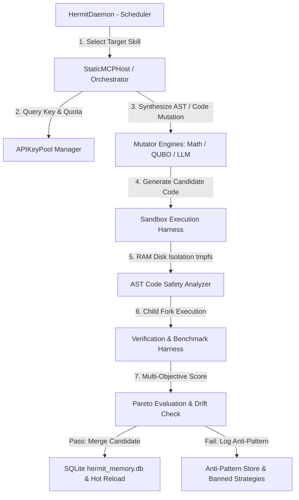

# ARCHITECTURE.md
## Phase 2 - System Architecture & Engineering Blueprint

This document details the software architecture, core component responsibilities, execution flows, data flows, extension points, and internal interfaces of **Project Hermit** (`v0.1.9`).

---

### 1. High-Level Architectural Diagram

---

### 2. Core Components & Responsibilities

#### A. Host Controller & Registry (`orchestrator.py`)
* **Classes**: `Orchestrator`, `StaticMCPHost`
* **Responsibilities**:
  * Acts as the static, non-mutable host process managing dynamic skill registration and evaluation.
  * Manages baseline harness freezing and calculates SHA-256 baseline hashes (`harness_hash`).
  * Enforces `IMMUTABLE_FUNCTIONS` protection (`get_next_target`, `sandbox_run`, `detect_oscillation`).
  * Manages the quota-aware API keypool (`APIKeyPool`) with RPM, TPM, and daily token tracking.
  * Evaluates candidates using hierarchical Pareto multi-objective scoring (latency gate, memory guard, code complexity tiebreaker).

#### B. Autonomous Scheduler Daemon (`hermit_daemon.py`)
* **Classes**: `HermitDaemon`
* **Responsibilities**:
  * Implements the **Dual-Phase Scheduler**:
    * **Phase 1 (Untouched Headroom)**: Targets skills with 0 merges prioritized by headroom (`latency × complexity`).
    * **Phase 2 (Bottleneck Sort)**: Targets high-latency skills with max consecutive attempt limits (`MAX_CONSECUTIVE = 3`) to prevent starvation.
  * Monitors CPU temperature trend slopes and applies predictive thermal throttling (adjusting sleep durations and sandbox parallelism).
  * Performs rolling linear regression of latency improvements over a 20-minute window; shuts down on `GLOBAL_PLATEAU_SHUTDOWN` if slope improvement drops below 5%.

#### C. Isolated RAM-Disk Sandbox Engine (`sandbox.py`)
* **Classes**: `SandboxResult`
* **Responsibilities**:
  * Mounts a 32MB `tmpfs` RAM disk (`sandbox_run`) to prevent physical disk wear and isolate execution environments.
  * Enforces dynamic `RLIMIT_AS` virtual memory bounds and `RLIMIT_CPU` limits (30s timeout).
  * Executes AST static analysis (`analyze_code_safety`) to block dangerous system calls (`os.system`, `subprocess`, file system wipes).
  * Computes fork-based grandchild memory measurement to accurately measure peak RSS without cumulative `RUSAGE_CHILDREN` noise.

#### D. Mutable Payload & Dynamic MCP Server (`dynamic_mcp_server.py`)
* **Responsibilities**:
  * Houses target python skill implementations decoupled from the host controller.
  * Supports hot-reloading via Python's `importlib.reload` upon candidate merges.
  * Exposes tools for mathematical AST mutation (`math_mutator.py`) and quantum-classical QUBO spin-flip optimization (`qubo_mutator.py`).

---

### 3. Data Flow & Execution Lifecycle

1. **Target Selection**: `HermitDaemon.get_next_target()` queries `active_skills` in `hermit_memory.db` to determine the target skill using Phase 1 or Phase 2 rules.
2. **Baseline Verification**: `StaticMCPHost` fetches the frozen baseline harness and hash. If harness hash drifts (`HARNESS_DRIFT_ERROR`), candidate merge is aborted.
3. **Mutation & Synthesis**: The code candidate is generated using AST folding, QUBO bitwise transformation, or LLM code synthesis.
4. **Sandbox Execution**: `sandbox.run_in_sandbox()` executes the code candidate inside the RAM disk environment, enforcing AST safety checks and timing limits.
5. **Score & Pareto Gate**: `Orchestrator.evaluate_candidate()` computes relative latency delta, memory delta, and character complexity delta:
   $$\text{Score} = \text{Latency (ms)} \times 0.6 + \text{Memory (KB)} \times 0.2 + \text{Complexity (chars)} \times 0.2$$
6. **Merge & Hot-Reload**: If Pareto criteria pass, the function code in `dynamic_mcp_server.py` is updated, the version is incremented in `version_history`, and downstream dependency regression tests (`skill_dependencies`) are triggered.

---

### 4. Extension Points & Internal Interfaces

* **Custom Mutators**: Mutator plugins implement the AST tree transformation interface (e.g. `mutate_math_in_code`, `mutate_qubo_in_code`).
* **API Key Pool Interface**: Multi-key configuration via `api_keys.txt` supporting automated rotation upon rate-limit (`429`) or quota exhaustion.
* **Database Backup Hook**: Automated 30-minute `VACUUM INTO` backup hook triggers snapshot saves (`hermit_memory_backup_*.db`).
