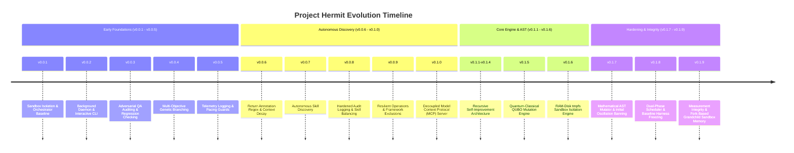

# HISTORY.md
## Phase 3 - Project Evolution & Version History

This document details the chronological evolution, version milestones, architectural pivots, and experimental phases of **Project Hermit** reconstructed directly from the 19 release directories (`v0.0.1` through `v0.1.9`).

---

### 1. Evolutionary Timeline & Major Milestones

---

### 2. Version Breakdown & Architectural Pivots

#### Phase I: Early Foundations & Sandbox Baseline (`v0.0.1` - `v0.0.5`)
* **v0.0.1**: Established basic process-level sandbox execution and SQLite persistence (`hermit_memory.db`).
* **v0.0.2**: Introduced background daemon (`hermit_daemon.py`) and interactive terminal interface (`hermit_chat.py`).
* **v0.0.3**: Added adversarial QA edge-case verification (`adversarial_tests`).
* **v0.0.4**: Implemented initial multi-objective genetic candidate branching (`skill_branches`).
* **v0.0.5**: Added resource limit telemetry tracking (`limit_telemetry`) and API call pacing.

#### Phase II: Autonomous Discovery & Decoupled Payload (`v0.0.6` - `v0.1.0`)
* **v0.0.6**: Added return annotation regex parsing and context decay logic for failed tests.
* **v0.0.7**: Introduced autonomous skill discovery from external source files (e.g. `iron_dome.py`).
* **v0.0.8**: Balanced multi-skill optimization queueing to prevent single-skill monopolization.
* **v0.0.9**: Added `EXCLUDED_SKILLS` framework protection list to safeguard key orchestrator components.
* **v0.1.0**: **Major Pivot**: Decoupled host orchestrator logic from mutable target skills via dynamic MCP payload architecture (`dynamic_mcp_server.py`).

#### Phase III: AST Mutators & Sandbox Hardening (`v0.1.1` - `v0.1.6`)
* **v0.1.1 - v0.1.4**: Developed static dependency graph extraction (`skill_dependencies`) for cross-skill regression testing.
* **v0.1.5**: Integrated QUBO & quantum-classical mutation engine (`qubo_mutator.py`), converting $O(N^2)$ global quadratic updates to $O(N)$ local bitwise spin flips.
* **v0.1.6**: **Major Pivot**: Implemented RAM-disk (`tmpfs`) sandbox mounting (32MB) to prevent physical SSD storage wear and isolate execution environments.

#### Phase IV: Measurement Integrity & System Hardening (`v0.1.7` - `v0.1.9`)
* **v0.1.7**: Added AST math mutator (`math_mutator.py`) and initial strategy count-based banning.
* **v0.1.8**: Resolved queue starvation via **Dual-Phase Scheduling** (Phase 1 untouched headroom vs Phase 2 bottleneck sort) and implemented baseline harness hash freezing (`HARNESS_DRIFT_ERROR`).
* **v0.1.9**: **Current Release**: Replaced cumulative `RUSAGE_CHILDREN` memory reporting with fork-based grandchild sandbox measurement (resolving `0.0 KB` RAM reporting), implemented period-based cycle oscillation detection, unified UTC timestamps, and added linear regression plateau auto-shutdown.

---

### 3. Historical Lessons & Key Technical Refinement Cycles

1. **The Queue Starvation Fix (v0.1.7 -> v0.1.8)**:
   * *Observation*: Bottleneck sort (`AVG(duration_ms) DESC`) caused 3 skills to absorb 80.1% of all merges, leaving 89.6% of skills untouched.
   * *Fix*: Phase 1 scheduling forces optimization of zero-merge skills using optimization headroom (`latency × complexity`).
2. **The Strategy Ban Overcorrection Fix (v0.1.8 -> v0.1.9)**:
   * *Observation*: Count-based banning immediately penalized newly merged successful strategies due to historical counts in `version_history`.
   * *Fix*: Replaced count banning with 6-merge recency sequence cycle detection (`A-B-A-B` or `A-B-C-A-B-C` patterns).
3. **The RAM Measurement Anomaly Fix (v0.1.8 -> v0.1.9)**:
   * *Observation*: Sandbox reported `0.0 KB` RAM usage because `RUSAGE_CHILDREN` measured cumulative peak RSS across all past terminated child processes.
   * *Fix*: Implemented fork-based grandchild process monitoring to measure exact per-run peak RSS.
