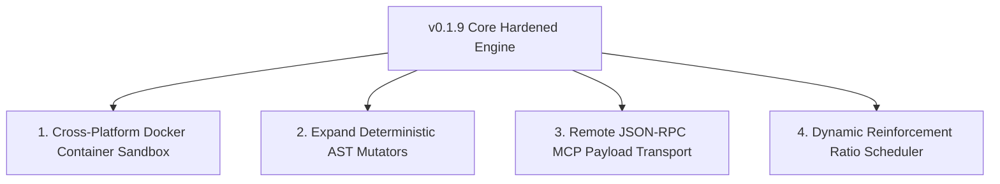

# NEXT_STEPS.md
## Phase 16 - Future Roadmap & Next Steps

This document outlines the evidence-grounded future development trajectory, feature roadmap, and expected impact for **Project Hermit** (`v0.1.9+`).

---

### 1. Evidence-Based Feature Roadmap

The following future directions are inferred strictly from existing TODOs, architecture gaps, and experimental branches within the codebase:

---

### 2. Roadmap Items & Implementation Specifications

#### Item 1: Containerized Docker / PRoot Sandbox Isolation Layer
* **Reason it Naturally Follows**: `sandbox.py` is currently restricted to Linux systems with `tmpfs` and `/proc` privileges. Adding a Docker/PRoot fallback enables cross-platform execution on macOS and Windows hosts.
* **Expected Impact**: Enables deployment on developer workstations without native Linux kernel privileges.
* **Difficulty**: Medium.
* **Dependencies**: Docker SDK for Python / `proot` binary executable.
* **Possible Risks**: Minor container launch overhead (~100-200ms per run).

#### Item 2: Expansion of Deterministic AST Transformation Engines
* **Reason it Naturally Follows**: LLM synthesis consumes ~91,600 tokens per merge on complex untouched functions, whereas AST mutators (`math_mutator.py`, `qubo_mutator.py`) achieve 100% pass rates with zero token cost.
* **Expected Impact**: Reduces overall token consumption by 60-80% during Phase 1 exploration loops.
* **Difficulty**: Medium.
* **Dependencies**: Python `ast` module.
* **Possible Risks**: Limited to statically analyzable mathematical and algorithmic code blocks.

#### Item 3: Remote Microservice MCP Payload Transport
* **Reason it Naturally Follows**: Decoupling `dynamic_mcp_server.py` via HTTP / gRPC transport allows mutating remote payload services without sharing local filesystem state.
* **Expected Impact**: Enables multi-node distributed payload optimization across remote host clusters.
* **Difficulty**: High.
* **Dependencies**: gRPC / FastAPI / Model Context Protocol (MCP) JSON-RPC standard.
* **Possible Risks**: Network latency overhead during verification harness runs.

#### Item 4: Dynamic Reinforcement Learning Ratio Scheduler
* **Reason it Naturally Follows**: The fixed ratio between Phase 1 (untouched skills) and Phase 2 (bottleneck sort) can be dynamically adjusted based on convergence rates and remaining API token budgets.
* **Expected Impact**: Optimizes resource allocation by automatically shifting focus to high-value targets when token budgets are low.
* **Difficulty**: High.
* **Dependencies**: `hermit_daemon.py`, `skill_budgets` database metrics.
* **Possible Risks**: Over-fitting to short-term optimization gains.
