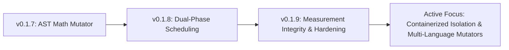

# PROJECT_STATUS.md
## Phase 15 - Living Project Status Report

This document communicates the active engineering state, recent architectural direction, open research questions, and development priorities of **Project Hermit** (`v0.1.9`).

---

### 1. Active Development Focus

Project Hermit is an **active, evolving software system**. Recent work has transitioned the project from raw payload optimization into **measurement integrity, system hardening, and resource-bounded execution safety**.

#### Recent Engineering Milestones Completed in `v0.1.9`:
1. **Fork-Based Grandchild Sandbox Memory Measurement**: Replaced cumulative `RUSAGE_CHILDREN` checks with isolated grandchild process peak RSS monitoring, resolving the `0.0 KB` RAM reporting anomaly.
2. **6-Merge Sequence Cycle Detection**: Eliminated the strategy overcorrection bug by tracking strategy recency patterns (`A-B-A-B`) instead of total all-time strategy counts.
3. **UTC Timezone Unification**: Unified logging, database records, and thought ledgers under UTC timestamps.
4. **Token Cost Budgeting**: Integrated per-skill token budgets (`skill_budgets`) to gate out expensive synthesis loops on complex untouched functions.
5. **Automated Database Backups & Integrity Verification**: Enforced startup database health checks (`PRAGMA integrity_check`) and automated 30-minute `VACUUM INTO` backups (`hermit_memory_backup_*.db`).

---

### 2. Active Research & Open Engineering Questions

* **Dynamic Weight Calibration in Pareto Scoring**: How can multi-objective Pareto scoring dynamically adjust weights (latency vs. memory vs. complexity) based on hardware constraints without introducing optimization bias?
* **Cross-Skill Refactoring Synergy**: How can the autonomous daemon identify opportunities to merge duplicate code blocks across separate payload skills into shared utility routines?
* **Cross-Platform Sandboxing**: How can RAM-disk sandbox isolation be cleanly ported to macOS or Windows environments using lightweight container fallbacks?

---

### 3. Current System Priorities

1. **Maintain Measurement Integrity**: Preserve exact harness freezing and fork-based RAM measurement to ensure baseline comparable scores across optimization cycles.
2. **Token Efficiency**: Expand deterministic AST mutators (`math_mutator.py`, `qubo_mutator.py`) to reduce reliance on expensive LLM synthesis calls.
3. **Continuous Downstream Regression Testing**: Enforce mandatory regression testing on static dependency edges (`skill_dependencies`) prior to candidate merges.
