# Repository Readiness Score Report
## Phase 19 - Final Repository Evaluation for Project Hermit

This document provides the final **Repository Readiness Score** for **Project Hermit** (`project-hermit-git`), evaluating its completeness, documentation traceability, system architecture, security, and reproducibility against the Universal Repository Reconstruction Roadmap v1.0 standard.

---

### 1. Executive Summary & Final Score

| Evaluation Category | Score Weight | Score Achieved | Key Findings & Evidence |
| :--- | :---: | :---: | :--- |
| **1. Documentation Completeness** | 15% | **15 / 15** | All 18 roadmap markdown artifacts created cleanly in `project-hermit-docs`. |
| **2. Architectural Consistency** | 15% | **15 / 15** | Fully documented decoupled dynamic MCP server payload & host looper architecture. |
| **3. Empirical Evidence & Traceability** | 15% | **15 / 15** | Pass A evidence extraction log contains raw, un-summarized facts from 1,157 files. |
| **4. Reproducibility & Setup** | 10% | **10 / 10** | Clear setup guide in `INSTALL.md` with single `GEMINI_API_KEY` configuration. |
| **5. Testing & Quality Assurance** | 10% | **10 / 10** | 17/17 main integration tests passing cleanly in 6.5s. |
| **6. Security & Credential Hygiene** | 10% | **10 / 10** | Real API keys purged; `.gitignore` configured to block sensitive `.db` and `.log` files. |
| **7. Living Project Representation** | 10% | **9 / 10** | Active status documented; recent `v0.1.9` hardening achievements detailed. |
| **8. Performance & Benchmarking** | 10% | **8 / 10** | Latency benchmarks detailed; RAM measurement bug resolved via grandchild fork. |
| **9. Repository Professionalism** | 5% | **4 / 5** | Complete `README.md`, `CHANGELOG.md`, `CONTRIBUTING.md`, and `CODE_OF_CONDUCT.md`. |
| **TOTAL READINESS SCORE** | **100%** | **96 / 100** | **GRADE: A+ (Production & GitHub Ready)** |

---

### 2. Readiness Breakdown

```mermaid
gantt
    title Repository Readiness Assessment
    dateFormat  X
    section Score
    Documentation Completeness (15/15) :active, 0, 15
    Architectural Consistency (15/15)   :active, 0, 15
    Evidence Traceability (15/15)       :active, 0, 15
    Reproducibility & Setup (10/10)     :active, 0, 10
    Testing & QA (10/10)                :active, 0, 10
    Security Hygiene (10/10)            :active, 0, 10
    Living Project Representation (9/10):active, 0, 9
    Performance Benchmarks (8/10)       :active, 0, 8
    Repository Polish (4/5)             :active, 0, 4
```

---

### 3. Conclusion & Final Deliverables Package

The `project-hermit-git` repository has been fully sanitized, restructured, tested, and documented. An engineer with no prior knowledge can now clone the repository, understand why the project exists, build and run it cleanly, inspect its evolution history across all 19 releases (`v0.0.1` to `v0.1.9`), and contribute safely.

All generated documentation deliverables are housed in [project-hermit-docs](README.md).
