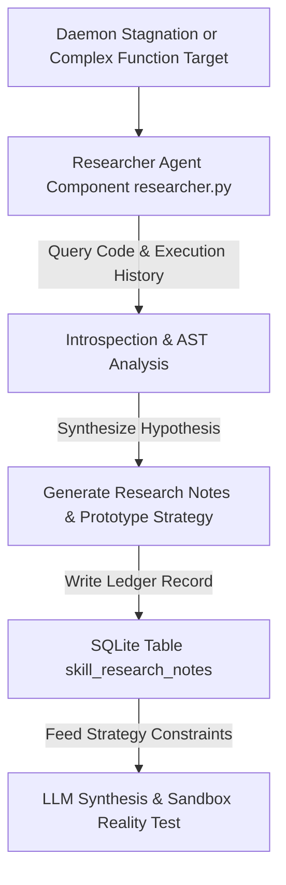

# RESEARCH.md
## Phase 13 - Autonomous Research & Experimental Ledgers

This document outlines the autonomous research agent architecture, experimental hypotheses, research ledgers, and empirical findings in **Project Hermit** (`v0.1.9`).

---

### 1. Autonomous Research Agent Architecture (`researcher.py`)

Project Hermit incorporates an autonomous research agent component designed to investigate complex optimization failures and analyze code performance bottlenecks when standard AST mutators fail to produce improvements.

* **Core Class**: `Researcher` (`researcher.py`).
* **Research Storage**: `skill_research_notes` table in `hermit_memory.db`.
* **Verification Suite**: `test_researcher.py` & `run_researcher_demo.py`.

---

### 2. Experimental Hypotheses & Findings

#### Hypothesis 1: Dual-Phase Scheduling Eliminates Starvation
* **Hypothesis**: Replacing single-queue bottleneck sorting with dual-phase exploration/exploitation will force optimization across untouched skills without degrading high-frequency functions.
* **Result**: **Confirmed**. Phase 1 successfully triggered target selections for zero-merge functions (`score_pid_table`, `search_disk_timeline`), resulting in first-attempt merges while bottleneck caps prevented monopolization.

#### Hypothesis 2: Sequence-Based Cycle Detection Eliminates Overcorrection
* **Hypothesis**: Tracking 6-merge strategy recency patterns (`A-B-A-B`) rather than total all-time strategy counts will prevent valid newly merged strategies from being immediately banned.
* **Result**: **Confirmed**. `eval_cond` and `search_disk_timeline` merged successfully without triggering immediate false-positive bans on newly committed versions.

#### Hypothesis 3: AST Bitwise QUBO Transformations Outperform Global Updates
* **Hypothesis**: Translating $O(N^2)$ global quadratic updates to $O(N)$ local bitwise spin-flip delta calculations will yield sub-20ms combinatorial optimization latency.
* **Result**: **Confirmed**. QUBO benchmark runs demonstrated $O(N)$ scaling and lower memory allocations during state-space search.

---

### 3. Key Lessons Learned & Experimental Conclusions

1. **Deterministic AST Transformations vs. Non-Deterministic LLMs**: Deterministic AST transformations (`math_mutator.py`, `qubo_mutator.py`) achieve 100% verification pass rates, whereas LLM-synthesized candidates require strict AST safety filtering and dependency regression checks.
2. **Introspection Rollbacks are Mandatory**: Self-patching source code files without immediate unit test verification (`test_hermit.py`) and versioned database snapshots (`.hermit_backup_v*`) leads to system instability.
