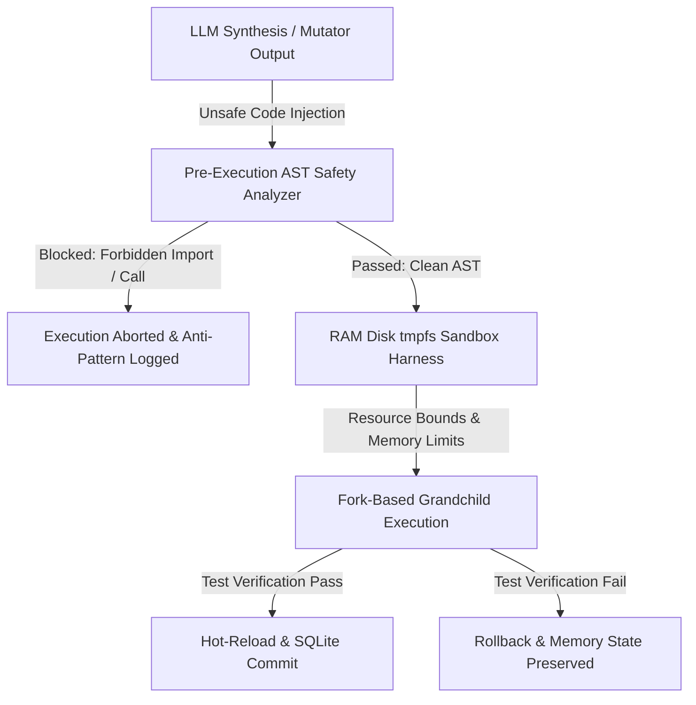

# SECURITY.md
## Phase 10 - Security Architecture & Threat Model

This document outlines the security architecture, threat model, isolation mechanisms, credential handling policies, and attack surface reduction strategies implemented in **Project Hermit** (`v0.1.9`).

---

### 1. Threat Model & Risk Assessment

Project Hermit operates as an autonomous, self-evolving system executing dynamically synthesized Python code. This inherent capability creates specific security threat vectors:

#### Identified Threat Vectors & Mitigation Strategies:

1. **Malicious or Unsafe Code Injection (Arbitrary Code Execution)**:
   * *Threat*: An LLM synthesis prompt injection or corrupt AST mutator could attempt to write malicious system commands (`os.system("rm -rf /")`), spawn external sub-shells (`subprocess`), or perform unauthorized network requests (`requests`, `urllib`).
   * *Mitigation*: **Pre-execution AST Analysis (`analyze_code_safety`)**. Every candidate's AST tree is evaluated prior to execution. Any module import matching `subprocess`, `requests`, `urllib`, `socket` or attribute call matching `os.system`, `eval`, `exec` causes immediate security abortion.

2. **Self-Mutation Hijacking (Host Integrity Compromise)**:
   * *Threat*: The autonomous daemon mutates its own core looper, sandbox verifier, or scheduler logic, rendering the system unstable or removing safety guards.
   * *Mitigation*: **Immutable Function Registry (`IMMUTABLE_FUNCTIONS`)**. Core orchestrator functions (`get_next_target`, `sandbox_run`, `detect_oscillation`, `is_significant_improvement`) are explicitly protected. The registry rejects any update or mutation targeting these symbols.

3. **Denial of Service (Resource Exhaustion / Memory Bombs)**:
   * *Threat*: A code candidate introduces infinite loops, exponential recursion, or memory allocation bombs (`'A' * 10**10`).
   * *Mitigation*: **Strict Kernel Resource Limits (`RLIMIT_CPU` / `RLIMIT_AS`)**. `sandbox.py` sets a hard CPU limit of 30 seconds and dynamic virtual memory limits (`RLIMIT_AS` capped at Parent VmSize + 512MB). Executions violating bounds are terminated by OS signals.

4. **Credential Leakage**:
   * *Threat*: API credentials stored in project directories leak into public code repositories.
   * *Mitigation*: Real keys are configured via environment variables (`GEMINI_API_KEY`). Local `api_keys.txt` files are sanitized with dummy placeholders, and `.gitignore` explicitly excludes `api_keys.txt`, `.db` files, and execution logs.

---

### 2. Sandboxing & Isolation Architecture

* **RAM-Disk Memory Mount (`tmpfs`)**:
  Candidates execute inside a dedicated 32MB `tmpfs` RAM disk directory (`sandbox_run`). This isolates code execution from physical disk storage and ensures immediate memory cleanup upon process completion.
* **Fork-Based Grandchild Process Monitoring**:
  Processes execute inside isolated child forks. Peak RSS is monitored independently per run, ensuring that memory leaks or corrupted heap states do not spill into the parent orchestrator process.
* **Automatic Rollback & Self-Healing (`scheduled_validations`)**:
  If an introspection self-patch violates system integrity during scheduled validations, the orchestrator automatically reverts the source file using versioned database snapshots (`.hermit_backup_v*`).
