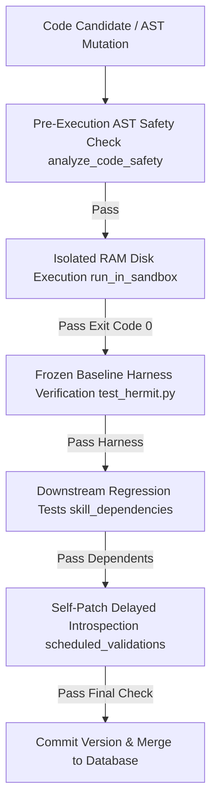

# TESTING.md
## Phase 12 - Testing Strategy & Verification Framework

This document outlines the testing methodology, verification harnesses, integration test suites, cross-skill regression testing, and quality assurance mechanisms in **Project Hermit** (`v0.1.9`).

---

### 1. Test Suite Architecture

Project Hermit incorporates a multi-layered testing hierarchy to ensure code stability during autonomous self-mutation:



---

### 2. Primary Test Suites & Verification Scripts

| Test Script | Target System / Component | Test Count | Description |
| :--- | :--- | :---: | :--- |
| `test_hermit.py` | System Core & Integration | 17 | Verifies database backups, self-patch rollbacks, baseline harness freezing, cycle oscillation detection, and discovery. |
| `test_integration.py` | Dynamic MCP Payload Reload | 4 | Tests dynamic module hot-reloading (`importlib.reload`) and MCP tool payload execution. |
| `test_math_mutator.py` | AST Math Mutator Unit Tests | 8 | Validates AST constant folding, algebraic simplification, and numeric safety. |
| `test_math_integration.py` | End-to-End Math Optimization | 3 | Verifies mathematical optimization execution inside isolated sandbox environments. |
| `test_qubo_mutator.py` | Quantum QUBO Bitwise Engine | 6 | Validates local $O(N)$ spin-flip delta updates and bitmask packing logic. |
| `test_qubo_integration.py` | QUBO Integration Harness | 3 | Verifies combinatorial optimization solving accuracy inside sandbox runs. |
| `test_key_rotation.py` | Keypool Quota & Pacing | 5 | Tests RPM/TPM headroom calculation, pacing delay guards, and single-key fallback mode. |
| `test_observer.py` | Resource Observer & Telemetry | 4 | Validates CPU thermal zone monitoring and process RSS metric collection. |

---

### 3. Verification Harness Freezing & Harness Drift Protection

To prevent "moving target" baseline inflation, Project Hermit freezes verification harnesses and baseline latency metrics when a skill is first registered:

* **Baseline Storage**: The initial verification code is stored in `active_skills.baseline_harness` alongside a 16-character SHA-256 hash (`harness_hash`).
* **Harness Drift Rejection (`HARNESS_DRIFT_ERROR`)**: Before evaluating a mutated candidate, `StaticMCPHost` compares the candidate's verification harness hash against the frozen baseline hash. If the harness code has changed, candidate evaluation is rejected immediately:
  ```text
  [HARNESS_DRIFT_ERROR] Verification harness for 'sum_of_squares' hash c0fff9 != frozen hash b3a481. Rejecting candidate.
  ```

---

### 4. Cross-Skill Dependency Regression Testing

When a skill payload is updated, Project Hermit automatically extracts static call dependencies and updates `skill_dependencies` (44 active dependency edges).

* **Downstream Trigger**: Mutating skill $A$ triggers automated sandbox regression checks on all dependent skills $\{B_1, B_2, \dots, B_n\}$ that reference $A$.
* **Regression Rollback (`REGRESSION`)**: If any downstream dependent skill fails its verification harness after $A$'s modification, candidate $A$ is marked as a regression failure and discarded.
