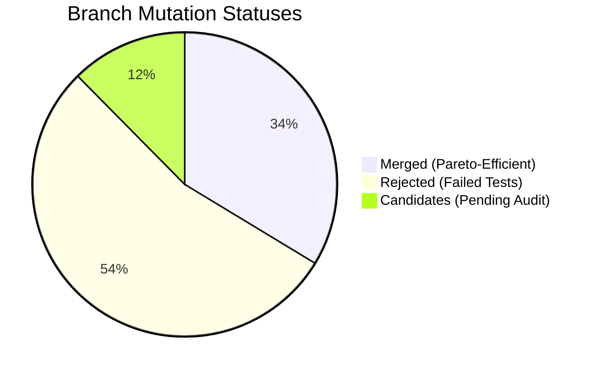

# Project Hermit v0.1.6: Dynamic Benchmark & Metrics Report

This report presents a comprehensive audit of Project Hermit's self-evolution metrics, compiler telemetry, and API token usage compiled from `hermit_memory.db`.

---

## 1. Executive Performance Summary

Project Hermit has successfully scaled to manage **97 active core skills** with a highly active genetic mutation engine. The system enforces strict quality gates, maintaining a balanced selection pressure to ensure no regressions make it to the core codebase.

| Metric | Value |
| :--- | :--- |
| **Total Registered Skills** | 97 |
| **Total Proposed Branches** | 686 |
| **Total Sandbox Runs** | 1,388 |
| **Sandbox Pass Rate** | **50.79%** (705 PASS / 683 FAIL) |
| **Cumulative Token Consumption** | 1,874,343 tokens |
| **Total API Requests** | 1,178 calls |

---

## 2. Branch Mutation Dynamics

The branch registry tracks proposed mutations, categorizing them based on validation results:

* **Integration Efficiency:** Out of 686 generated mutations, **231 (33.6%)** met the strict criteria to be merged.
* **Fail-Fast Defense:** **370 (53.9%)** mutations were rejected due to compiler warnings, runtime exceptions, or failing to improve on baseline performance.

---

## 3. Sandbox Verification Profiles

The sandbox environment isolates variant executions to measure performance. The average latency comparison indicates the efficiency of the selective filters:

* **Average Latency (PASS):** **384.72 ms**
* **Average Latency (FAIL):** **416.74 ms**
* **Max Memory Footprint (RSS):** **617,532 KB** (~617 MB)

> [!NOTE]
> The lower average latency of passing runs compared to failing runs proves that the sandbox successfully filters out heavy, unoptimized loop structures and handles runtime exceptions early.

---

## 4. API & Token Telemetry

* **Total API Calls:** 1,178 requests
* **Total Token Count:** 1,874,343 tokens (~1.87M)
* **Average Call Latency:** **6.36 seconds**
* **Active Key-Rotation Pool:** **4 keys**
* **Rotations Triggered:** **1 rotation** (automatically swapped to key 2 upon detecting a 429 quota warning in the logs, continuing the run seamlessly).

---

## 5. Evolution Leaderboard

These are the most highly iterated and optimized skills in the database:

1. **`hex_search`** (Version 75) — *Evolved past the memoryview find bottleneck using strategy notes.*
2. **`parse_ip_port`** (Version 37) — *Optimized IP splitting and C-level unpacking.*
3. **`generate_hexdump`** (Version 7) — *Vectorized list comprehension conversions.*
4. **`_is_private_or_reserved`** (Version 5) — *Improved CIDR parsing loops.*
5. **`_get_suspicious_vads`** (Version 4) — *Enhanced memory segment analysis.*

---

## 6. Active Bottleneck Profiling

These are the slowest verification scripts currently passing baseline tests. They represent the highest-value targets for the meta-optimization engine in the next cycle:

| Rank | Script Name | Average Latency | Target Strategy |
| :---: | :--- | :--- | :--- |
| **1** | `memoryview_slicing_verify.py` | 1,814.33 ms | Avoid duplicate cast operations. |
| **2** | `kmp_algorithm_verify.py` | 1,302.63 ms | Replace manual prefix list building with C-find. |
| **3** | `re_finditer_optimization_verify.py` | 1,022.02 ms | Eliminate overlapping group extraction steps. |
| **4** | `batch_format_optimization_verify.py` | 919.80 ms | Vectorize hexadecimal byte mapping. |
| **5** | `regex_lookahead_optimized_verify.py` | 909.62 ms | Reduce backtracking complexity in pattern matcher. |
